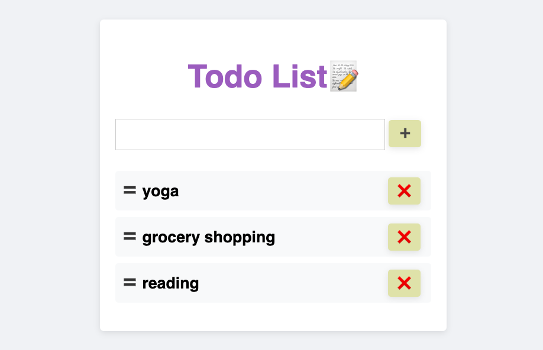

# Todo List

Simple Todo List with React and TypeScript

## Features

- Create a new item
- Delete an item
- Drag and drop an item by using react-beautiful-dnd (https://www.npmjs.com/package/react-beautiful-dnd)

## Acknowledgements

This code was developed by positive235(https://github.com/positive235) with the help of ChatGPT created by OpenAI.

- Developer: positive235(https://github.com/positive235)
- Debugging: Performed by positive235(https://github.com/positive235)
- Code Modifications: Made by positive235(https://github.com/positive235)

Assistance provided by ChatGPT:

- Source: ChatGPT(https://chat.openai.com/chat)
- Date of assistance: 2023-03-27

# Getting Started 

- You can try at https://positive235.github.io/todolist-ts-react/ or, 
- You can clone this repository and run it with these commands:
    1. `npm install`
    2. `npm start`